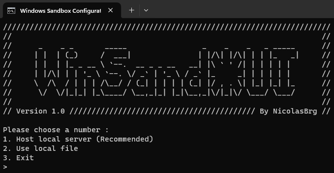

# WinSand*UI v1.0
## Overview
**WinSand*UI** is a utility tool designed by [NicolasBrg](https://github.com/NicolasBrg) to help with the creation of the Windows Sandbox configuration file. The project consists of two main components:

### Configuration Utility (CreateConfiguration.bat):

1. Server mode *(listens on port **12345**, network permission may be asked)* **[Recommended]**.
2. Local mode *(launches the interface in the browser)*.
3. Exit script.

### Startup Module (Sandbox.bat):

1. Start Sandbox *(Explanation below)*.
2. Delete content of `./Desktop/Archives` folder *(Hidden if folder is empty)*.
3. Exit script.

## Usage
### Configuration Utility (CreateConfiguration.bat)

The "**Use advanced mode**" field enables the display of additional advanced fields initially hidden for better visibility. Various explanations are available, particularly upon hovering over texts, but for comprehensive details, please refer to [Microsoft Sandbox Webpage](https://learn.microsoft.com/en-us/windows/security/application-security/application-isolation/windows-sandbox/windows-sandbox-overview).

The advanced configuration field "**Command to run at startup**" initiates the execution of the ``C/Shared/Setup.ps1`` script by default on the virtual machine when it is started. You can modify this script or directly add your custom command.

The folder mapping includes 5 columns:
1. A checkbox representing the activation of the mount point. If the box is unchecked, the line will be ignored.
2. A switch defining whether the mounted item will be read-only **(True by default)**.
3. The path on the host machine.
4. The path on the virtual machine (if the field is empty, the virtual path will be the same as that on the host).
5. A delete button, represented by a red cross. Two folders are created by default; they have a small cadena in place of the cross, preventing the editing of the line. Click on it to make the rule editable.

Click on the "**Create Windows Sandbox Configuration!**" button to generate your configuration file. Several tests are conducted, and you'll be notified of any issues.

Path indications have three colors:
- **Orange**: Folder format detected.
- **Blue**: File format detected.
- **Grey**: Unable to determine path type.

**In server mode**, a new browser page launches after you make a selection. This allows you to click on file and folder icons, you'll be able to select files and folders on your computer. This ensures full access to your computer's directory without the risk of configuration errors.

You can stop the server using the red button "**Stop the server**", but languages, images and browsers features will stop working properly.

### Startup Module (Sandbox.bat)
1. Initiates the security script for archive analysis.
2. Prompts for archive selection and calculates the hash.
3. Sends the hash to VirusTotal for analysis **(requires a [key](https://www.virustotal.com/gui/sign-in))**.
4. Copies the archive to the `./Desktop/Archives` directory.
5. Prompts for wsb configuration file and starts the sandbox.

## Supported Languages
Three languages are available, you can only change the language if you are using the server.
- English **(Default)**.
- French.
- Spanish.

*The language id is saved in the browser's cookies. If you have deactivated them, the choice of language may not work correctly.*

## Prerequisites
- Enable Windows Sandbox feature *(Pro licenses of Windows)*.
- Windows operating system.
- The network permission may be asked by your system if you start the server to allow listening to http requests. 

## License
Everyone can use and modify this project for non-commercial purposes unless explicitly authorized by the owner. Source citation is mandatory.